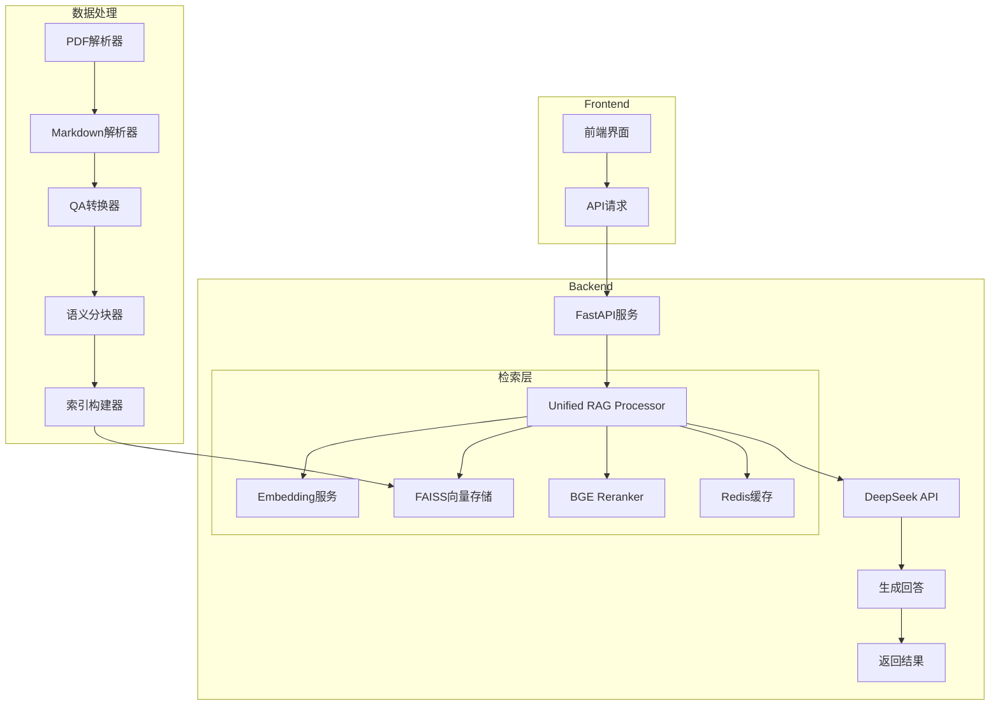

# RAGentX

> **Adaptive RAG System for Technical Interview Q&A**

一个面向技术面经的**自适应检索增强生成系统（Adaptive RAG）**，通过本地向量检索 + 大模型生成，实现高性能、高质量的智能问答。

## 项目简介

RAGentX 是一个结合本地检索与大模型生成的 RAG 系统，专为技术面经场景设计。系统支持 PDF / 文本解析，通过向量检索 + 自适应检索策略，实现精准问答。

## 核心特性

### 🚀 本地检索 + 模型生成
- **本地组件**：
  - Qwen3 Embedding（本地向量编码）
  - FAISS 向量检索（高效相似性搜索）
  - BGE Reranker（结果精排优化）
  - Redis 缓存（提升系统响应速度）
- **模型服务**：
  - DeepSeek API（deepseek-v4-pro）

### 🎯 自适应检索策略
- 根据问题类型动态选择检索策略
- 提高检索准确性和效率

### 📊 Reranker 精排优化
```
Query → TopK → Rerank → TopN
```
- 使用 BGE reranker 提升相关性
- 减少无关上下文干扰

### 📝 智能分块与排序
- 基于语义的文本分块，支持QA级和细粒度子chunk混合索引
- 智能排序，优先返回定义类内容，提升检索准确性
- 动态chunk size，根据内容类型自动调整分块大小

### 🎨 Markdown 渲染支持
- 前端支持 Markdown 格式渲染，包括代码块、表格和标题样式
- 保留原始文档的格式结构

### ❓ Q&A格式优化
- 自动识别和标准化Q&A格式，提升检索和生成质量
- 支持多种Q&A格式：Q1: 问题、问题：、问：等
- 智能提取问题、答案和标签

## 系统架构



## 技术栈

| 类别 | 技术 | 用途 |
|------|------|------|
| **后端框架** | Python (FastAPI) | 提供高性能API服务 |
| **RAG核心** | FAISS | 向量检索 |
| | Qwen Embedding | 本地向量编码 |
| | BGE Reranker | 结果精排 |
| | PyPDF2 | PDF文档解析 |
| **模型** | DeepSeek API (deepseek-v4-pro) | 生成高质量回答 |
| **缓存** | Redis | 提升系统响应速度 |
| **前端** | HTML/CSS/JavaScript | 提供用户交互界面 |
| | Marked.js | Markdown渲染 |

## 项目结构

```
RAGentX/                     # 项目根目录
├── data/                    # 数据目录
│   ├── raw/                 # 原始数据（文档）
│   │   └── *.pdf            # 原始 PDF 文档
│   ├── processed/           # 处理后数据
│   │   └── *.md/*.json      # 转换后的 Markdown 和 JSON 数据
│   └── index/               # 向量索引
│       └── faiss_index/     # FAISS 向量存储
├── rag-service/             # 在线服务
│   ├── api/                 # API 层
│   │   └── main.py          # FastAPI 入口文件
│   ├── core/                # 核心逻辑层
│   │   ├── embedding.py     # 向量嵌入服务
│   │   ├── generator.py     # 回答生成器
│   │   ├── reranker.py      # 重排序器
│   │   └── unified_rag_processor.py  # 统一 RAG 处理器
│   └── cache/               # 缓存层
│       └── redis_cache.py   # Redis 缓存实现
├── frontend/                # 前端界面
│   └── index.html           # 前端页面
├── .gitignore               # Git 忽略文件
└── README.md                # 项目说明文件
```

## 快速开始

### 1. 安装依赖

```bash
cd rag-service
pip install -r requirements.txt
```

### 2. 启动 Redis 容器（可选，用于缓存）

```bash
docker run -d -p 6379:6379 --name redis redis
```

### 3. 配置 DeepSeek API

在 `rag-service/.env` 文件中添加 DeepSeek API 密钥：

```env
# DeepSeek API配置
DEEPSEEK_API_KEY=your_deepseek_api_key_here
```

### 4. 启动服务

```bash
# 启动 RAG 服务
cd rag-service
python api/main.py

# 或者在项目根目录使用
python rag-service/api/main.py
```

服务将在 http://0.0.0.0:8000 上运行

## API 文档

服务启动后，可以访问以下API端点：

| 端点 | 方法 | 功能 |
|------|------|------|
| `/api/health` | GET | 健康检查 |
| `/api/ask` | POST | 发送查询并获取回答 |
| `/api/process-documents` | POST | 处理新文档并构建索引 |
| `/api/cache/clear` | POST | 清除所有缓存 |

### 示例请求

```bash
# 发送查询
curl -X POST http://localhost:8000/api/ask \
  -H "Content-Type: application/json" \
  -d '{"query": "什么是协程", "use_unified_rag": true, "top_k": 3, "retrieval_mode": "hybrid"}'

# 处理文档
curl -X POST http://localhost:8000/api/process-documents

# 清除缓存
curl -X POST http://localhost:8000/api/cache/clear

# 健康检查
curl http://localhost:8000/api/health
```

## 使用方法

### 1. 前端界面

打开浏览器访问 http://localhost:8000，使用前端界面进行交互：
- 在输入框中输入问题
- 点击"发送"按钮获取回答
- 查看生成的回答和相关参考资料

### 2. API调用

使用POST请求发送查询，获取JSON格式的回答：

```bash
curl -X POST http://localhost:8000/api/ask \
  -H "Content-Type: application/json" \
  -d '{
    "query": "什么是协程",
    "use_unified_rag": true,
    "top_k": 3,
    "retrieval_mode": "hybrid"
  }'
```

## 示例

### 输入
```
什么是协程
```

### 输出
```
协程（Goroutine）是与其他函数或方法同时运行的函数或方法。Goroutines 可以被认为是轻量级的线程。与线程相比，创建 Goroutine 的开销很小。Go 应用程序同时运行数千个 Goroutine 是非常常见的做法。
```

### 输入
```
简述 Go GC 原理
```

### 输出
```
Go GC 使用标记清除算法，分为标记和清除两个阶段，采用三色标记法（黑、灰、白），通过写屏障技术处理并发标记时的引用变化，整个过程分为标记准备、标记、标记结束、清理四个阶段，其中标记准备和标记结束阶段会暂停程序，并发标记阶段可以与程序并行执行。
```

## 性能优化

- **Top-K 控制**：减少召回数量，避免噪声
- **Reranker 精排**：提升相关性
- **Prompt 优化**：减少幻觉和串台
- **答案后处理**：确保格式正确
- **智能分块**：提升检索准确性
- **自适应排序**：优先返回定义类内容
- **Redis 缓存**：减少重复查询延迟，提升系统吞吐量

## 项目亮点

- **工程化架构**：采用企业级目录结构，数据处理与在线服务分离
- **可扩展性**：模块化设计，支持未来功能扩展
- **Adaptive RAG 检索策略**：动态选择检索方式，提高检索准确性
- **本地检索 + 模型生成**：数据不出本地（检索部分），生成质量更高
- **FAISS + reranker**：提升问答准确率和相关性
- **高性能 API 服务**：基于 FastAPI 实现，响应速度快
- **PDF 文档解析**：使用 PyPDF2 实现 PDF 文档的处理和转换
- **智能分块与排序**：基于语义的文本分块，支持QA级和细粒度子chunk混合索引
- **动态chunk size**：根据内容类型自动调整分块大小，提升检索准确性
- **Q&A格式优化**：自动识别和标准化Q&A格式，提升检索和生成质量
- **Markdown 渲染**：保留原始文档格式，提升用户体验
- **Redis 缓存**：减少重复查询延迟，提升系统吞吐量

## 故障排除

### 常见问题

1. **服务启动失败**
   - 检查 DeepSeek API 密钥是否正确配置
   - 确保 Redis 服务（如果使用）正常运行
   - 检查端口 8000 是否被占用

2. **回答质量问题**
   - 确保文档已正确处理和索引
   - 尝试调整 `top_k` 参数
   - 检查文档内容是否与问题相关

3. **性能问题**
   - 启用 Redis 缓存
   - 调整 `top_k` 参数减少召回数量
   - 确保系统资源充足

## 贡献指南

欢迎贡献代码、提出问题或建议！请按照以下步骤：

1. Fork 本项目
2. 创建功能分支
3. 提交更改
4. 发起 Pull Request

## License

MIT License